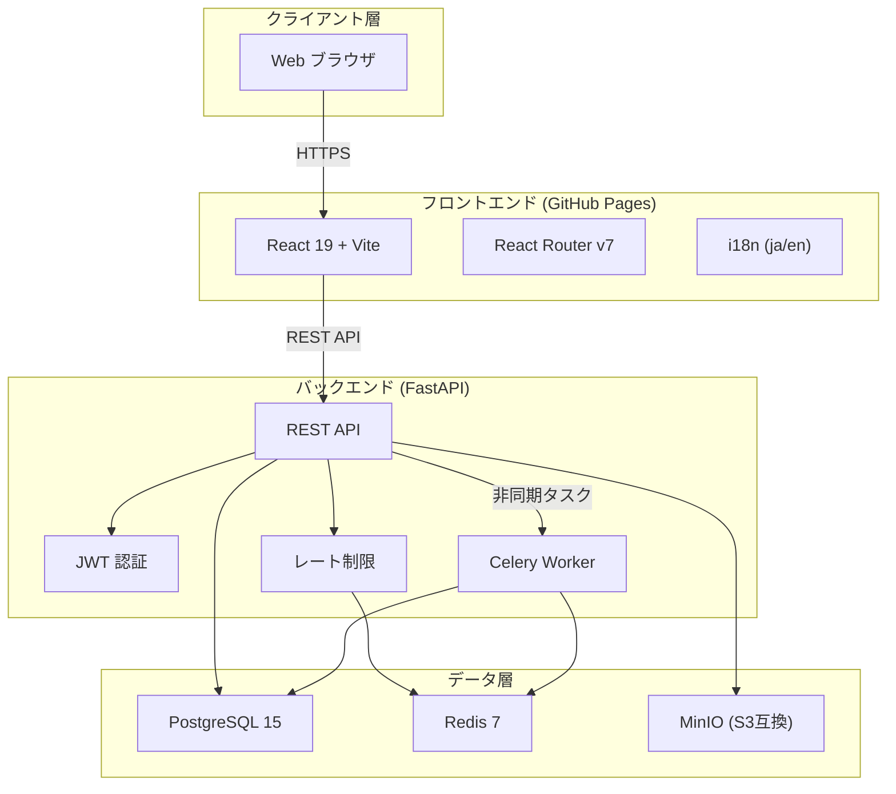

# MemoLucky — 大学生向けキャンパスコミュニティプラットフォーム

<div align="center">


**投稿・フリマ・研究室・就活情報をひとつに集約した大学生専用コミュニティ**

[🌐 Live Demo](https://syokan00.github.io/Database_Final/) · [📖 ドキュメント](#documentation) · [🚀 クイックスタート](#quick-start)

</div>

---

## 📸 スクリーンショット

| ホーム（投稿フィード） | フリマ出品一覧 | 通知センター |
|---|---|---|
| *(screenshot)* | *(screenshot)* | *(screenshot)* |

| プロフィール & バッジ | DM メッセージ | 多言語対応 |
|---|---|---|
| *(screenshot)* | *(screenshot)* | *(screenshot)* |

> **🎮 今すぐ体験**: [https://syokan00.github.io/Database_Final/](https://syokan00.github.io/Database_Final/)

---

## ✨ 主な機能

### 👤 ユーザー管理
- JWT 認証（Argon2 パスワードハッシュ）
- プロフィール / アバター / カバー画像
- フォロー & フォロワー管理

### 📝 経験談投稿
- Markdown 対応のリッチ投稿
- タグ & 匿名投稿サポート
- いいね・コメント・画像添付

### 🛍️ フリマ（学内フリーマーケット）
- 商品出品・購入申請フロー
- 出品者とのダイレクトチャット
- カテゴリ別フィルタリング

### 🏆 バッジ & 実績システム
- 初投稿・連続投稿・夜型ユーザーなど 8 種類のバッジ
- Celery 非同期タスクによるリアルタイム付与

### 🔔 通知システム
- いいね・コメント・フォロー・メッセージを即座に通知
- 未読バッジ表示 & 一括既読処理

### 🌍 多言語対応
- 日本語 / English（i18n フレームワーク実装済み）

### 🔒 セキュリティ
- Redis によるレート制限（API スロットリング）
- bleach による XSS 対策（HTML サニタイズ）
- CORS 設定 & JWT 有効期限管理

---

## 🏗️ システムアーキテクチャ



---

## 🗄️ データベース設計（主要テーブル）

```
users ─────────┬──< posts ──< comments
               │         └──< likes
               ├──< items ──< item_messages
               ├──< follows
               ├──< notifications
               └──< badges (user_badges)
```

| テーブル | 説明 |
|---|---|
| `users` | ユーザー情報・プロフィール |
| `posts` | 経験談投稿（タグ・添付・匿名対応） |
| `items` | フリマ出品商品 |
| `comments` | 投稿コメント |
| `follows` | フォロー関係 |
| `notifications` | 通知（いいね・フォロー等） |
| `badges` / `user_badges` | バッジ定義 & 付与記録 |
| `messages` | ダイレクトメッセージ |

---

## 🛠️ 技術スタック

| レイヤー | 技術 |
|---|---|
| **フロントエンド** | React 19.2, Vite 7.2, React Router 7, Axios, Lucide React |
| **バックエンド** | FastAPI 0.104, SQLAlchemy 2.0, Pydantic v2 |
| **データベース** | PostgreSQL 15 |
| **キャッシュ / 制限** | Redis 7 |
| **オブジェクトストレージ** | MinIO (S3 互換) |
| **非同期タスク** | Celery 5.3 |
| **認証** | JWT (python-jose) + Argon2 |
| **インフラ** | Docker Compose, GitHub Actions, GitHub Pages |

---

## 🚀 クイックスタート

### 必要環境
- Docker & Docker Compose
- Node.js 18+

### 1. リポジトリをクローン

```bash
git clone https://github.com/syokan00/Database_Final.git
cd Database_Final
```

### 2. 環境変数を設定

```bash
cp backend/env.example backend/.env
# .env を編集して SECRET_KEY などを設定
```

### 3. Docker で起動

```bash
docker compose up -d
```

### 4. フロントエンドをローカル起動

```bash
cd frontend
npm install
npm run dev
```

ブラウザで `http://localhost:5173` にアクセス

### デフォルトサービスポート

| サービス | URL |
|---|---|
| フロントエンド (dev) | http://localhost:5173 |
| FastAPI | http://localhost:8000 |
| API ドキュメント | http://localhost:8000/docs |
| PostgreSQL | localhost:5432 |
| Redis | localhost:6379 |
| MinIO Console | http://localhost:9001 |

---

## 📂 プロジェクト構成

```
Database_Final/
├── frontend/               # React + Vite SPA
│   └── src/
│       ├── components/     # 共通UIコンポーネント
│       ├── contexts/       # Context API (Auth, Notification)
│       ├── pages/          # ページコンポーネント
│       ├── i18n/           # 多言語定義 (ja/en)
│       └── utils/          # ユーティリティ
├── backend/                # FastAPI アプリ
│   └── app/
│       ├── auth.py         # JWT認証
│       ├── posts.py        # 投稿API
│       ├── items.py        # フリマAPI
│       ├── badges.py       # バッジAPI
│       ├── notifications.py# 通知API
│       ├── messages.py     # DM API
│       └── celery_app.py   # 非同期タスク
├── database/               # DBマイグレーション
├── docs/                   # 設計ドキュメント
│   ├── BA/                 # ビジネス分析 (ペルソナ, ストーリー)
│   ├── Architect/          # アーキテクチャ設計
│   ├── DBA/                # DB設計 (ER図)
│   ├── Infra/              # インフラ設計
│   └── PM/                 # プロジェクト管理
└── docker-compose.yml
```

---

## 📖 ドキュメント <a id="documentation"></a>

| カテゴリ | 内容 |
|---|---|
| [BA / ビジネス分析](docs/BA/) | ペルソナ・モチベーショングラフ・ストーリーボード |
| [アーキテクチャ](docs/Architect/) | システム構成・DR バックアップ・RPO/RTO |
| [DB 設計](docs/DBA/) | ER 図・インデックス設計・パーティション戦略 |
| [インフラ](docs/Infra/) | Docker 設定・GitHub Actions・デプロイ手順 |
| [PM](docs/PM/) | WBS・マイルストーン・リスク管理 |

---

## 🧪 テスト

```bash
cd backend
pip install pytest pytest-asyncio httpx
pytest tests/ -v
```

---

## 📄 ライセンス

MIT License — [LICENSE](LICENSE)
